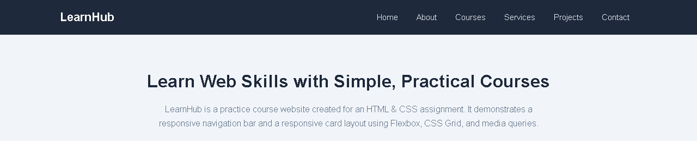
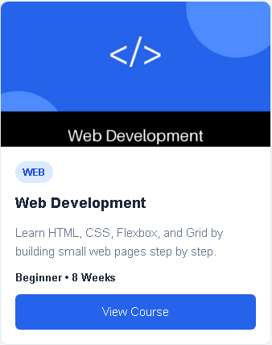
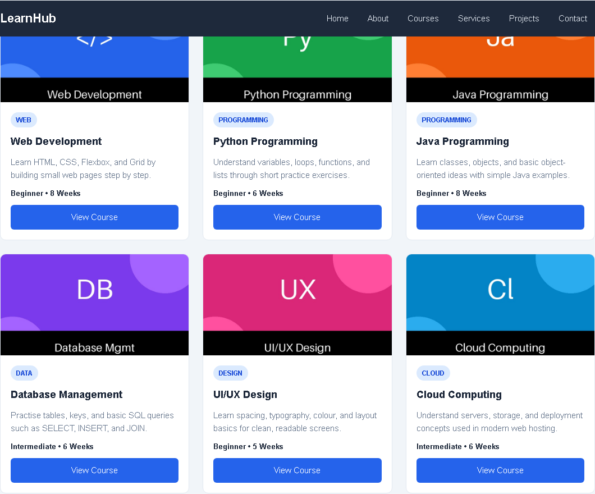
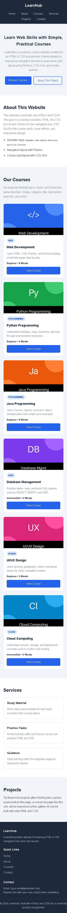

# HTML & CSS — Navigation Bar and Card Design

## 1. Assignment Title

HTML & CSS — Navigation Bar and Card Design

Topic: Building a Navigation Bar and Responsive Card Layout Using HTML & CSS

## 2. Student Information

Name: Sulav Shrestha
Student ID: 2602412295
Course/Module: [Your Course/Module]
Level: [Your Level]
Assignment: HTML & CSS Practical Assignment
College: Patan College For Professional Studies

> Replace each placeholder above with your real details before submitting.

## 3. Project Description

This project is a simple **Course Website** called LearnHub, built with only **HTML5** and **CSS3**.

The website contains:

- A **navigation bar** with the brand name and links (Home, About, Courses, Services, Projects, Contact)
- A **hero / introduction section** explaining the project
- An **about section** describing what was practised
- A **card section** with **6 course cards** (Web Development, Python Programming, Java Programming, Database Management, UI/UX Design, Cloud Computing)
- Small **Services** and **Projects** sections so every nav link has a target
- A **footer** with quick links and contact placeholders

Layout techniques used:

- **CSS Flexbox** for the navigation bar layout
- **CSS Grid** for the card layout (3 cards per row on desktop, 2 on tablet, 1 on mobile)
- **Responsive CSS with media queries** so the site works on desktop, laptop, tablet, and mobile
- Subtle **hover effects** on nav links, cards, and buttons

No JavaScript and no frameworks (no Bootstrap / Tailwind / React) are used.

## 4. Technologies Used

- HTML5
- CSS3
- CSS Flexbox
- CSS Grid
- Responsive CSS (media queries)

## 5. Learning Resources

> IMPORTANT: Update this table to reflect only the resources you actually used.
> The rows below are the typical resources for this assignment — delete or edit any row you did not use, and add anything else you really studied.

| No. | Resource | Topic Learned | What I Learned | How I Applied It |
|-----|----------|---------------|----------------|-------------------|
| 1 | Teacher's lecture / class material | HTML structure and CSS basics | I learned how headings, paragraphs, links, and lists form the structure of a page, and how CSS changes colours, fonts, and spacing. | I applied this to build the page skeleton with `header`, `nav`, `main`, `section`, and `footer`, and to style text and backgrounds. |
| 2 | University learning material / slides | Box model and Flexbox | I learned that every element has content, padding, border, and margin, and that Flexbox can align navigation items horizontally with spacing between them. | I applied this to the navigation bar using `display: flex`, `justify-content: space-between`, and `align-items: center`. |
| 3 | MDN Web Docs (HTML and CSS pages) | Semantic HTML, CSS Grid, and media queries | I learned which tags to use for meaning (like `nav` for navigation and `article` for a card), how Grid makes equal columns, and how media queries change styles at different screen widths. | I applied this by using `article` for each card, `display: grid` with `repeat(3, 1fr)` for the card layout, and breakpoints at 900px and 600px. |
| 4 | YouTube / online tutorial (add exact title + link if used) | Card design and hover effects | I learned how padding, borders, border-radius, and subtle hover styles make cards look clean and interactive. | I applied this to the course cards with rounded corners, `object-fit: cover` for images, and a small lift + shadow on hover. |

Example of student-language explanation (keep this style when you write your own row):

- "I learned how Flexbox can be used to align navigation items horizontally and control spacing between them. I applied this concept to the navigation bar using `display: flex`."

## Navigation Bar



*Screenshot 1 — navigation bar. Take it after the project is open in the browser (see screenshot instructions below).*

## Card Design



*Screenshot 2 — single card close-up showing image, category tag, title, description, level info, and button.*

## Card Layout



*Screenshot 3 — all 6 cards in the desktop 3-per-row grid.*

## Responsive Design



*Screenshot 4 — mobile view with 1 card per row and stacked navigation.*

> Screenshots were captured from this actual project rendered in Chromium at desktop (1280px) and mobile (390px) widths. If you replace the card images later, re-capture the affected screenshots so they match.

## Key Concepts Learned

- **Semantic HTML:** Using tags that describe their meaning, such as `header`, `nav`, `main`, `section`, `article`, and `footer`, so the page structure is clear to browsers and readers.
- **CSS selectors:** Patterns like `.card`, `.nav-links a`, and `.card:hover` that select which elements to style.
- **Box model:** Every element has content in the middle, then padding, then border, then margin. `box-sizing: border-box` keeps padding inside the stated width so layouts do not break.
- **Flexbox:** A one-direction layout method. Used here for the navbar (brand left, links right) and for stacking card content vertically.
- **CSS Grid:** A rows-and-columns layout method. Used here for the cards: `repeat(3, 1fr)` means three equal columns.
- **Typography:** Choosing readable fonts, sizes, and line spacing. This project uses a simple system font with clear heading sizes.
- **Spacing:** Using margin (space outside) and padding (space inside) plus `gap` in Flexbox/Grid so nothing looks crowded.
- **Hover effects:** Style changes when the mouse is over an element, e.g. nav links change colour and cards lift slightly. Done with `:hover` and `transition`.
- **Responsive design:** The page adapts to screen size. Media queries change the grid from 3 columns to 2 (tablet) to 1 (mobile), and stack the navbar on small screens.

## Challenges and Solutions

> These are realistic implementation challenges based on this code. Verify them against your own experience and rewrite in your own words before the viva.

**Challenge 1: Keeping all cards at a consistent height.**
Cards had different amounts of text, so some looked taller than others.
Solution: The card uses `display: flex; flex-direction: column` and the card body uses `flex: 1`, so all bodies stretch equally. The button uses `margin-top: auto` so it always sits at the bottom, and all images have a fixed height (`180px`) with `object-fit: cover` so they never stretch the card.

**Challenge 2: Making the website responsive without breaking the layout.**
On small screens three cards in one row became too narrow and caused overflow.
Solution: CSS media queries change the grid: `repeat(3, 1fr)` on desktop, `repeat(2, 1fr)` below 900px (tablet), and `1fr` below 600px (mobile). The navbar also switches to a vertical stack below 600px, and `overflow-x: hidden` plus `max-width: 100%` on images prevents horizontal scrolling.

## Project Structure

```text
html-css-assignment/
│
├── index.html
│
├── css/
│   └── style.css
│
├── images/
│   ├── web-development.jpg
│   ├── python.jpg
│   ├── java.jpg
│   ├── database.jpg
│   ├── ui-ux.jpg
│   └── cloud.jpg
│
├── screenshots/
│   ├── navigation-bar.png
│   ├── card-design.png
│   ├── card-layout.png
│   └── responsive-design.png
│
└── README.md
```

## How to Run

1. Copy the `html-css-assignment` folder to your computer.
2. Make sure the `images/` folder contains the 6 `.jpg` files listed above.
3. Open `index.html` in a browser (double-click it, or right-click → Open With → your browser). In VS Code you can also use the Live Server extension.
4. Resize the browser window to test desktop (wide), tablet (medium), and mobile (narrow) layouts.

## Screenshot Instructions

Take the screenshots yourself after opening `index.html` in a browser. In most browsers press `F12` to open dev tools if you need a specific screen size.

1. **navigation-bar.png** — Scroll to the very top so the full navbar (brand + all links) is visible. Capture only the top of the page. Save as `screenshots/navigation-bar.png`.
2. **card-design.png** — Scroll to the Courses section and zoom in (or crop) so ONE card fills most of the screenshot. The image, tag, title, description, level, and button must all be readable. Save as `screenshots/card-design.png`.
3. **card-layout.png** — Zoom out to 100%, use a wide desktop window, scroll so all 6 cards are visible. Capture the whole card grid. Save as `screenshots/card-layout.png`.
4. **responsive-design.png** — Narrow the browser to a mobile width (about 375–480px wide, or press `Ctrl+Shift+M` in Firefox / device toolbar in Chrome and pick a phone). Capture the stacked navbar and single-column cards. Save as `screenshots/responsive-design.png`.

## GitHub Repository

GitHub Repository:
[PASTE YOUR GITHUB REPOSITORY URL HERE]

### How to upload this project to GitHub

1. Create a new repository on GitHub (e.g. named `html-css-assignment`). Do not initialise it with extra files if you will push from your local folder.
2. On your computer, open a terminal inside the `html-css-assignment` folder.
3. Run:
   ```bash
   git init
   git add index.html css/style.css images/ screenshots/ README.md
   git commit -m "Add HTML and CSS navigation bar and card layout assignment"
   git branch -M main
   git remote add origin [PASTE YOUR GITHUB REPOSITORY URL HERE]
   git push -u origin main
   ```
4. Replace `[PASTE YOUR GITHUB REPOSITORY URL HERE]` in this README with your real repository URL.
5. Check on GitHub that `index.html`, `css/style.css`, `images/`, `screenshots/`, and `README.md` are all visible.

## Image Credits

The card images in `images/` are external images provided by the student (not the generated placeholders). Document each source below as required by the assignment. Replace the placeholders with the real source / website / licence for each image you used.

- `images/python.jpg` — Python logo image. Source: [paste source URL]
- `images/database.jpg` — Database cylinder icon (watermarked ComputerHope.com). Source: [paste source URL, e.g. computerhope.com] — note: watermarked images should ideally be replaced with a non-watermarked or self-made image.
- `images/web-development.jpg` — Web development graphic (HTML5/JS/jQuery/Java/PHP/WordPress/Rails). Source: [paste source URL]
- `images/java.jpg` — Java Language graphic. Source: [paste source URL]
- `images/ui-ux.jpg` — UI/UX phone mockup graphic. Source: [paste source URL]
- `images/cloud.jpg` — Cloud computing graphic. Source: [paste source URL]

If any image is your own screenshot or creation, write "Own image" as the source.

## AI Usage

AI tools were used as a learning and development aid during this assignment. AI assistance was used to help understand HTML/CSS concepts, structure the project, identify possible improvements, and explain code. The final implementation was reviewed and adjusted so that I could understand the concepts used.

> Make sure you can explain every part of the code yourself — the assignment may include a viva / practical evaluation.

## Code Explanation (short version)

1. `<header>` holds the top of the page (the navbar) so browsers know it is introductory content.
2. `<nav>` marks the navigation block specifically, so screen readers and search engines know these links are for moving around the site.
3. `<ul>`, `<li>`, `<a>` make a proper list of links: `ul` = the list, `li` = each item, `a` = the clickable link. Lists are the correct, accessible way to group nav links.
4. `<main>` wraps the main page content (only once per page); `<section>` splits it into topics (hero, about, courses, services, projects).
5. `<article>` is used for each card because a card is a self-contained item that would still make sense on its own.
6. Flexbox is used for the navbar because it easily puts the brand on the left and links on the right in one row with even spacing.
7. CSS Grid is used for the cards because it easily makes equal-width columns (3 → 2 → 1) with a single `gap` for spacing.
8. Hover effects use the `:hover` selector plus `transition`, e.g. `.card:hover { transform: translateY(-5px); }` lifts the card smoothly.
9. Media queries like `@media (max-width: 900px)` mean "apply these styles only when the screen is 900px wide or smaller".
10. On mobile the grid becomes `1fr` (one column) and the navbar becomes vertical (`flex-direction: column`), so nothing overflows.
11. Images have fixed height + `object-fit: cover` (crops without stretching) and `max-width: 100%`, plus descriptive `alt` text.
12. `margin` is space outside an element, `padding` is space inside it. Both create breathing room.
13. The box model is content → padding → border → margin. `box-sizing: border-box` makes width include padding/border, so layouts stay predictable.

## Viva Preparation (short Q&A)

**Q1. What is semantic HTML?**
Using tags that describe their purpose, like `header`, `nav`, `main`, `section`, `article`, and `footer`.

**Q2. Why did you use `<nav>`?**
To mark the navigation links block so browsers and screen readers know it is for site navigation.

**Q3. Why did you use Flexbox for the navigation bar?**
Because Flexbox easily places items in one row with alignment and spacing (`justify-content`, `align-items`, `gap`).

**Q4. Why did you use CSS Grid for the cards?**
Because Grid easily creates equal columns (3 on desktop) with even gaps, and the column count can change in media queries.

**Q5. What is the CSS box model?**
Content in the centre, then padding, then border, then margin. It controls how element size and spacing work.

**Q6. What is a hover effect?**
A style change when the mouse is over an element, written with `:hover`, e.g. colour change or card lift.

**Q7. How did you make the website responsive?**
With media queries that change the grid columns and stack the navbar on small screens, plus fluid images and no fixed widths that overflow.

**Q8. What is a media query?**
A CSS rule like `@media (max-width: 600px)` that applies styles only at certain screen sizes.

**Q9. How many cards did you create?**
Six: Web Development, Python, Java, Database, UI/UX, and Cloud.

**Q10. What happens to the cards on mobile?**
They become one per row (`grid-template-columns: 1fr`) so each card is full width and easy to read.

**Q11. What is the purpose of alt text?**
It describes the image for screen readers and shows if the image fails to load.

**Q12. What resources did you use?**
(Answer truthfully — see the Learning Resources table. Example: class material, university slides, MDN Web Docs, and a tutorial.)

**Q13. How did AI help you?**
It helped me understand concepts, structure the project, and explain code. I reviewed the final code so I can explain it myself.
